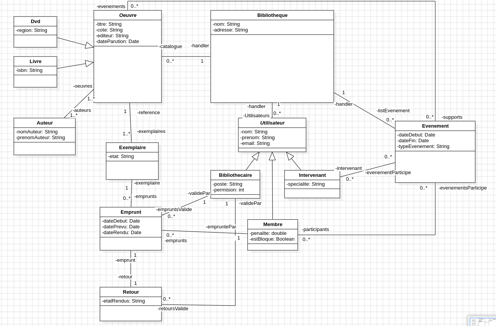

<h1 align="center">System de Gestion de Bibliotheque</h1>

<p align="center">
    
    
</p>

---

## Features
- **Catalog** - find and view works; manage multiple types of content within a work; view detailed content about a work; create a virtual list of physical objects.
- **Loans** - lend, return, extend, and keep track of all lending history by member.
- **Admin** - manage members; manage librarians; view all action logs.
- **Authors** - add/remove author(s).
- **Events** - run conferences; manage speakers.
- **Security** - role based access for librarians.

## Build
### Prerequisites
* Java JDK 11+
* Make (optional)

### Make commands
| Command       | Use                          |
| ------------- | ---------------------------- |
| `make`        | Compile the project          |
| `make run`    | Launch the app               |
| `make clean`  | Delete `out/`                |
| `make fclean` | Delete `out/` and `lib/`  |
| `make re`     | fclean + make                |

### Build and launch without make
If you don't have `make` installed:

**Compilation:**
```bash
mkdir -p out
javac -d out -cp "out:lib/*" -encoding UTF-8 $(find src -name "*.java")
```

**Running:**
```bash
java -cp "out:lib/*" com.bibliotheque.Main
```

 ## UML

 